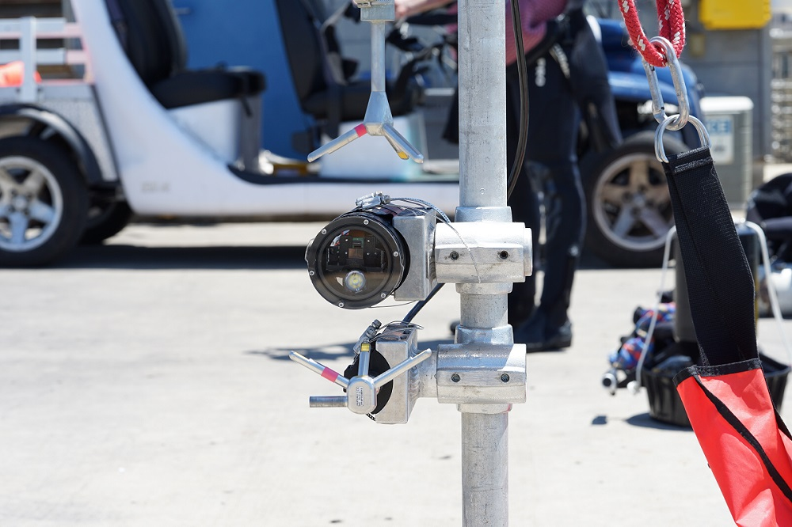

# Video Velocimeter


This Github repository contains information about the Video Velocimeter (VIV) for measuring bulkflow velocity of underwater current. Here is a brief introduction to how to utilize the repository. 

The detailed description of the instrument can be found in the [journal publication](https://journals.ametsoc.org/view/journals/atot/38/6/JTECH-D-20-0115.1.xml "journal publication").

# Data Analysis
The notebook `VIV Data Analysis.ipynb` contains an example of how to analyze raw video data collected by the VIV. We recommend running this script on Google Colab to make sure that the base packages are already installed. The only package that needs to be installed is the OpenPIV package, which can be installed by the command
```
pip install openpiv
```
An example data is given in the folder `Data`. 

# Other Scripts
## Deploy Scripts
This folder contains python scripts that are run on the Raspberry Pi that controls the VIV during a deployment. 

## Test Scripts
This folder contains python scripts for testing parts of the VIV one at a time. 